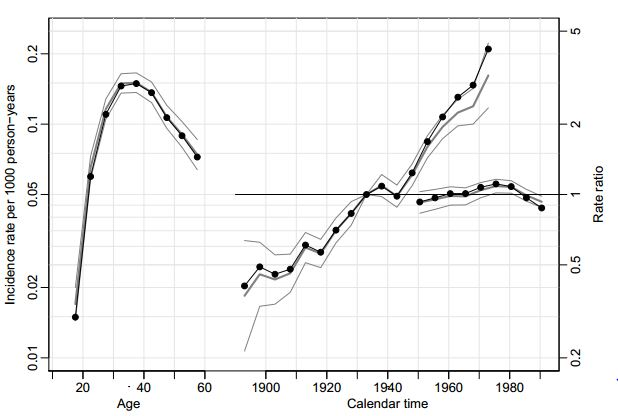
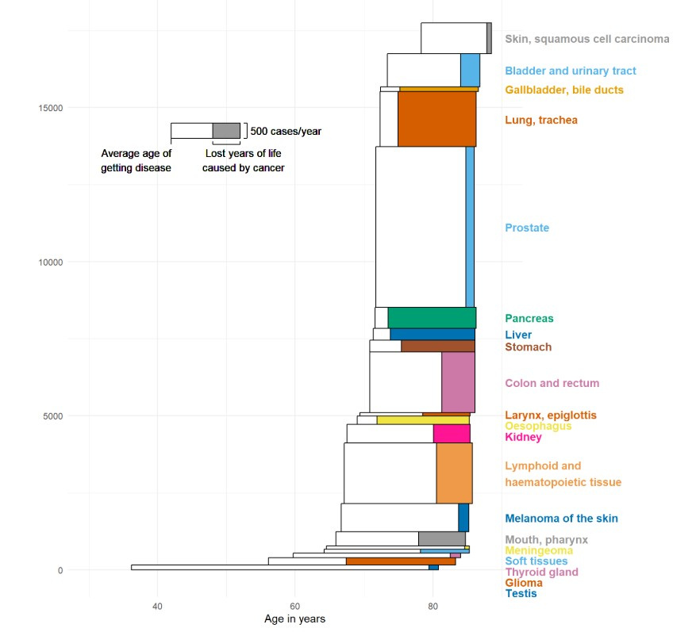

# Contents

-   Basic properties of R
-   Script files
-   Data structures and objects
-   Data input and output
-   Functions
-   Tabulation functions

# What is R

-   Statistical software or ''package'' --- and a lot more
-   R is a **language**and **environment**for statistical computing and graphics (www.r-project.org)
-   Developed by volunteers, coordinated by the **R Development Core Team.**
-   Available for Windows, Linux, Mac, Unix, ...
-   Is expanding rapidly: new version every 6 months.
-   No licence fee(!) & source code open.

For further information and download: <https://cran.r-project.org/>

# R ecosystem

-   R language and program (R)

-   base R (core packeges or functions of R)

-   R package system (Comprehensive R Archive Network, CRAN)

-   Development tool (RStudio)

-   Dynamic documentation/publishing (quarto)

# CRAN - R community

::::: columns
::: {.column width="60%"}
-   CRAN is a collection of packages

-   Packages  (20 000+) are collections of new commands/functions, that are developed and shared by the worldwide R userbase.

-   base R containes several package and operations

-   If your needs are unmet by base R, there’s likely a package for it

-   In epidemiology most useful packages are survival and Epi.

-   Entire ecosystems of packages exist (*Tidyverse)*
:::

::: {.column width="40%" echo="F"}
$\includegraphics[width=0.8\linewidth]{Rlogo}$
:::
:::::

# Rstudio - script development

-   RStudio is an integrated development environment (IDE) for R and Python.

-   It includes a console, syntax-highlighting editor that supports direct code execution, and tools for plotting, history, debugging, and workspace management.

-   RStudio is available in open source and commercial editions and runs on the desktop (Windows, Mac, and Linux).

# Quarto - dynamic publishing

-   **Quarto** is an open-source system designed for creating interactive and reproducible documents. Here are some key points about Quarto:

-   **Markdown-Based**: Quarto documents are authored using Markdown, making it easy to format text and include code and visualizations.

-   **Versatile Output**: You can generate documents in various formats, including HTML, PDF, and presentations.

-   **Integration**: Quarto supports integration with RStudio, and other editors, allowing for a seamless authoring experience.

-   **Dynamic Reports**: You can create dynamic reports and interactive dashboards using Quarto, making it suitable for scientific and technical writing.

# Properties of R

-   Large repertory of basic and advanced methods.
-   Versatile graphics of high quality.
-   R Reads datasets from Stata, SAS, SPSS, Epi-Info --  even Excel
-   Deals simultaneously with different objects or data structures newline -- not just a single data matrix.
-   Results of analysis saved as **objects**, readily available for further processing.
-   Parsimonious output listing!
-   For advanced users! Easy to expand and tailor to specific needs using the **object-oriented**programming tools.

# To learn more about R

-   **Carstensen**, **Bendix**, author. **Carstensen**, B. (2021). **Epidemiology** with R (First edition). Oxford University Press. <https://doi.org/10.1093/oso/9780198841326.001.0001>
-   *Statistical Practice in Epidemiology Using R*. An international course, IARC, Tarto, 2025. <http://bendixcarstensen.com/SPE/>
-   Hills, M., Plummer, M., Carstensen, B. *A Short Introduction to R for Epidemiology*, 2011.
-   Dalgaard, P. *Introductory Statistics with R, 2nd Ed.* Springer, New York, 2008.
-   R blog
-   Masses of books, articles, websites, etc ...

# What does R offer for epidemiologists?

-   Descriptive tools
    -   Versatile tabulation
    -   High-quality graphics
-   Analytic methods
    -   Basic epidemiologic statistics
    -   Generalized linear models and their extensions
    -   Survival analysis methods
    -   Other ...

These are provided by SAS and Stata, too, so why R ...?

Many features of R are more appealing in the long run.

# Graphics in R

-   Versatile, flexible, high quality, ...
-   Easy to add items (points, lines, text, legends,...) to an existing graph.
-   Fine tuning of symbols, lines, axes, colours, etc. by *graphical parameters* (\> 67 of them!)
-   Interactive tools using the mouse
    -   Put new things on a graph
    -   Identify points
-   Modern lattice or *Trellis* graphics.
-   Saving formats: Metafile, .pdf, .png, .bmp, .jpg, ....

# Age-period-cohort incidence in DK



# **Years of life lost due to cancer**

Average age of onset, life expectancy after diagnosis and years of life lost to cancer for men by cancer type in patients diagnosed 2014–2023.

{width="433" height="233"}

# Package or library

-   Collection of functions pertaining to some specialized application area, `e.g.` *survival, boot*
-   Contributed by users of R.
-   Available after loading: *\> library(survival)*
-   Alternatively load from the menu bar: *Packages - Load package... - Select one*
-   New versions easily updated from Internet. <https://www.rdocumentation.org/>

# R script -- R Studio -- commands in a file

**R script file** is an ASCII file containing a sequence of R commands to be executed.

The **script editor** -- use R-Studio

-   In `R-Studio` open the script editor window: *New file - R script*, or when editing an existing *script file*: *File - Recent Files*,

-   Save the `script file`: *Save* `e.g.` or *Save As* \*.R

-   Excecute a line *Ctrl-Enter*

# R script

-   Paint the lines to be excecuted and *Ctrl -Enter* will execute lines.

-   To run a whole script file, write in console window: \newline `> source("c:/.../mycmds.R", echo=TRUE)`

-   The script can also be written and edited by any external editor programs (like Notepad).

# Data objects of different kinds

-   *vector*: ordered set of similar elements \newline

    *e.g.*real numbers or character sequences

-   f*actor*: categorical variable with levels \newline \emph{e.g.} \texttt{gender}, levels: \texttt{c(1,2)} or \texttt{c('male', 'female')}; \medskip

-   \texttt{matrix, array}: 2- and k-dimensional tables, \medskip

-   \texttt{data.frame}: "data matrix" (more of this soon!), \medskip

-   \texttt{ts}: time series object, \medskip

-   \texttt{list}: sequence of different types of objects.

# R script -- R Studio -- commands in a file

**R script file** is an ASCII file containing a sequence of R commands to be executed.

The **script editor** -- use R-Studio

-   In `R-Studio` open the script editor window: *New file - R script*, or when editing an existing *script file*: *File - Recent Files*, \medskip \medskip
-   Save the `script file`: *Save* `e.g.` or *Save As* \*.R
-   Excecute a line *Ctrl-Enter*

# R script (cont'd)}

-   Paint the lines to be excecuted and *Ctrl -Enter* will execute lines. \medskip

-   To run a whole script file, write in console window: \newline `> source("c:/.../mycmds.R", echo=TRUE)`

-   The script can also be written and edited by any external editor programs (like Notepad).

# R script -- R Studio -- commands in a file

**R script file** is an ASCII file containing a sequence of R commands to be executed.

The **script editor** -- use R-Studio

-   In `R-Studio` open the script editor window: *New file - R script*, or when editing an existing *script file*: *File - Recent Files*, \medskip \medskip
-   Save the `script file`: *Save* `e.g.` or *Save As* \*.R
-   Excecute a line *Ctrl-Enter*

# R script (cont'd)}

-   Paint the lines to be excecuted and *Ctrl -Enter* will execute lines. \medskip

-   To run a whole script file, write in console window: \newline `> source("c:/.../mycmds.R", echo=TRUE)`

-   The script can also be written and edited by any external editor programs (like Notepad).

# Data objects of different kinds

-   \texttt{vector}: ordered set of similar elements \newline \emph{e.g.} real numbers or character sequences, \medskip
-   \texttt{factor}: categorical variable with levels \newline \emph{e.g.} \texttt{gender}, levels: \texttt{c(1,2)} or \texttt{c('male', 'female')}; \medskip
-   \texttt{matrix, array}: 2- and k-dimensional tables, \medskip
-   \texttt{data.frame}: "data matrix" (more of this soon!), \medskip
-   \texttt{ts}: time series object, \medskip
-   \texttt{list}: sequence of different types of objects.

<!-- -->

-   \texttt{vector}: ordered set of similar elements \newline \emph{e.g.} real numbers or character sequences, \medskip
-   \texttt{factor}: categorical variable with levels \newline \emph{e.g.} \texttt{gender}, levels: \texttt{c(1,2)} or \texttt{c('male', 'female')}; \medskip
-   \texttt{matrix, array}: 2- and k-dimensional tables, \medskip
-   \texttt{data.frame}: "data matrix" (more of this soon!), \medskip
-   \texttt{ts}: time series object, \medskip
-   \texttt{list}: sequence of different types of objects.

# Attributes of data objects

Functions that extract some key properties of objects:

-   \texttt{length( )}: number of elements, \medskip
-   \texttt{mode( )}: basic type of elements, \medskip
-   \texttt{dim( )}: dimensions of arrays, matrices and data frames, \medskip
-   \texttt{str( )}: overall structure, \medskip
-   \texttt{class( )}: property that determines how certain \newline *\*generic functions\*\* (\emph{e.g.} \texttt{summary(); plot()}) \newline work when the object is given as argument.

# Data frame -- data matrix

-   \[Data frame\] = a **list** of column vectors

-   Rows correspond to observational units, and \newline columns (same length) refer to variables. \medskip

-   Column vectors can be \newline \texttt{ numeric, character} or \texttt{logical} \medskip

-   Columns are \textbf{subobjects} of the data frame. Their \newline names are not directly accessible. Two possibilities:

    -   Use \`\`surname\$firstname'', e.g. \texttt{ mydata\$var1 },
    -   Place the data frame in the search path at position 2: \texttt{attach(mydata)}; then use just \`\`firstname'': \texttt{ var1}

# R is a functional language

Most computations in R involve the {invocation} or {call} of functions. They are called by name with a set of arguments separated by commas, \emph{e.g.} `fun(x, y, z) ;` **Function** \newline

-   = sequence of rules on how to produce desired output:
-   **value** of the function, from given input, *i.e.*
-   **arguments** of the function.

\emph{Example}: Function \texttt{sqrt()} computes square roots:

argument vector defined

```{r, echo=TRUE}
x <- c(0,1,2,3,4)
```

call with argument \texttt{x}

```{r, echo=TRUE,comment=NA}
sqrt(x)
```

# Defining a new function 

*Example*. Function \texttt{CIapp} to calculate an approximate confidence interval from point estimate (\texttt{estim}) and std error (\texttt{SE}) by formula \texttt{ estim} $\pm$ $z_{\gamma/2}\ \times$ \texttt{ SE}.

\medskip

Defining code (without prompts): \newline  \newline

```{r,echo=TRUE}
CIapp <- function(estim, SE, level = 0.95)
  {z <- qnorm(1- (1-level)/2 )  # setting the quantile
 lower <- estim - z*SE 
 upper <- estim + z*SE  
 CIapp <- c(lower, upper)   
 CIapp }
```

-   **Formal arguments**, here \texttt{ estim, SE, level}

# Calling the new function

-   **Actual arguments**, used in function call:

```{r,echo=TRUE,comment=NA}
CIapp(3, 1, 0.9) 
```

NB! **Positional matching**: order of actual arguments. \newline - **Keyword matching**: the order of arguments in the call is irrelevant if the names of formal arguments are given

```{r,echo=TRUE,comment=NA}
CIapp(SE=1.0, level=0.90, estim=3)
```

-   If a **default value** for an argument is given in the definition and is OK, it can be omitted in calling

```{r,echo=TRUE,comment=NA}
CIapp(3, 1) 
```

# Tools for epidemiological tabulations and models

::::: columns
::: {.column width="50%"}
1.  table(c1, c2): simple contingency tables

2.  xtabs( ) more elaborate tabulation features and addmargings () - add marginal frequencies

3.  **stat.table**( index = list(rvar, cvar)}, contents = list(count(), percent(rvar) ), in package **Epi** for more informative tabulation.

4.  package **dplyr** and ddply-funtion (tidyverse ecosystem)

5.  package **data.table** for larger data and other packages: janitor,... \dots
:::

::: {.column width="50%"}
1.  survival package for time to event basics

2.  generalized linear model -glm-function

3.  ci.lin in Epi-package for confidence intervals

4.  Lexis function in Epi package to split time for analysis
:::
:::::
